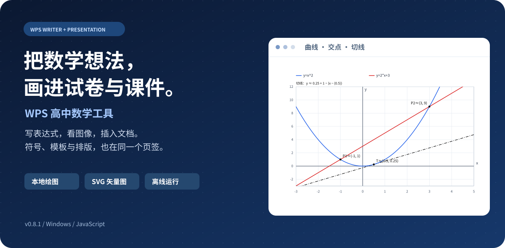
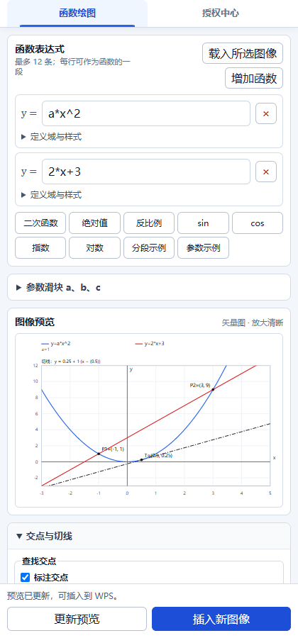
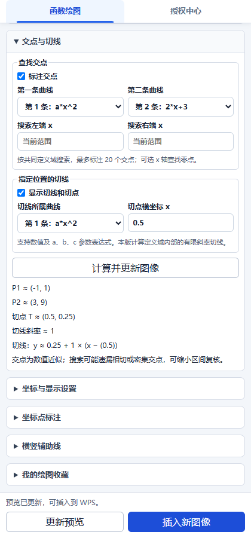
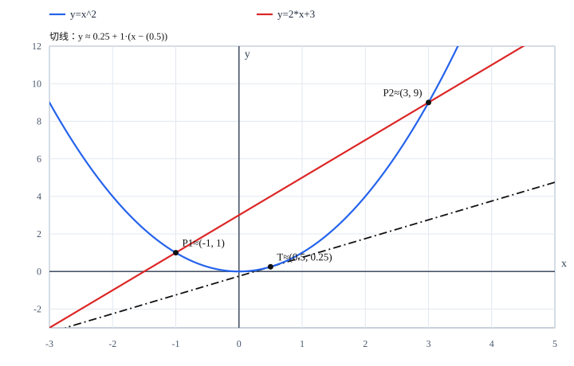
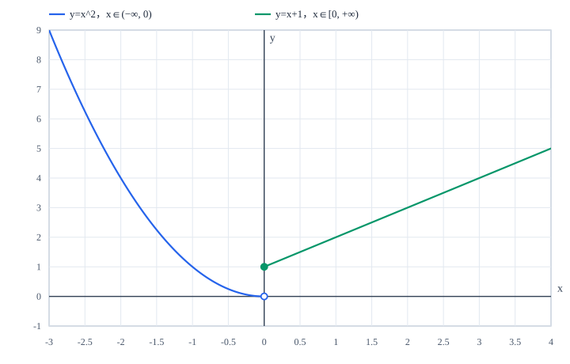
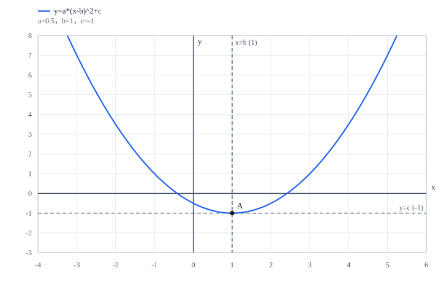
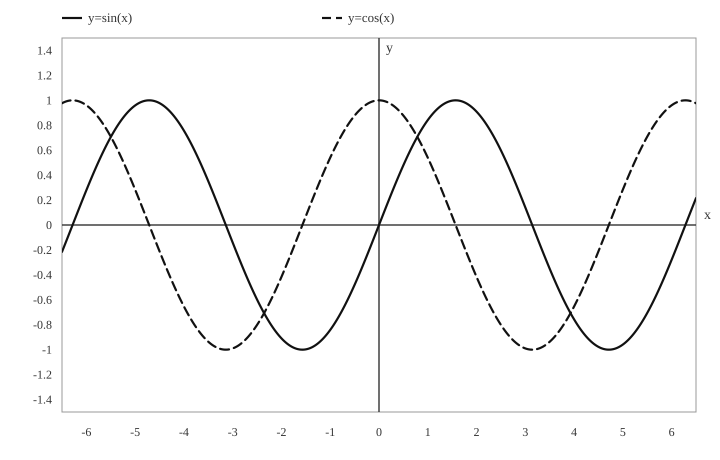
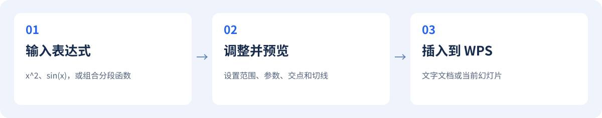

<div align="center">



# WPS 高中数学工具

**给数学老师的离线备课工具。**

数学符号 · 函数绘图 · 试卷模板 · 文档排版

**Windows**　｜　**WPS 文字 / 演示**　｜　**本地 SVG 绘图**　｜　**v0.8.1**　｜　[**MIT License**](LICENSE)

[看功能](#features) · [看绘图示例](#gallery) · [开始使用](#start) · [运行源码](#development) · [参与贡献](CONTRIBUTING.md)

</div>

---

在 WPS 中输入函数表达式，调整图像，直接插入试卷或课件。常用数学符号、卷头、题型模板和排版操作集中在一个 **「高中数学」页签**，减少在多个工具之间来回切换。

> **当前版本说明**
>
> 本仓库是现有桌面插件的源码，保留 14 天试用和离线激活机制；源码公开不会自动取消安装包的授权限制。0.8.1 已通过自动化与浏览器检查，尚需真实 WPS 验收。当前构建为未签名内部测试包。详见[版本与许可说明](#status)。

<a id="features"></a>
## 一眼看懂：它能做什么

| 备课场景 | 你可以做什么 | 支持位置 |
| :--- | :--- | :--- |
| **画函数** | 多曲线、分段函数、参数滑块、交点、切线、辅助线 | 文字 + 演示 |
| **输入符号** | 集合、关系、几何、代数、微积分、概率统计、希腊字母 | 文字 + 演示 |
| **制作试卷** | 插入卷头、题型标题、选择题布局、填空横线、解答题模板 | 文字 |
| **整理版式** | 对齐、行距、空格处理、A4 竖版与横向两栏、页码 | 文字 |
| **复用图像** | 载入所选图像并编辑；收藏、备份与恢复绘图方案 | 文字 + 演示 |

### 绘图时，常用按钮一直在手边

<table>
  <tr>
    <td width="50%" align="center"><b>输入表达式，立即看预览</b></td>
    <td width="50%" align="center"><b>展开分析，底部按钮仍然可用</b></td>
  </tr>
  <tr>
    <td align="center"></td>
    <td align="center"></td>
  </tr>
</table>

以上为 **0.8.1 共享工具窗格页面在浏览器中的真实截图**，不是 WPS 文档插入效果图。上方设置独立滚动，底部保留「更新预览」和「插入新图像／更新所选图像」。

<a id="gallery"></a>
## 用图像，讲清数学

下面四张 SVG 均由本项目的绘图引擎直接生成。点击图片可查看矢量图；对应参数保存在 [gallery.json](docs/examples/gallery.json)，可复现。

### 01　交点与切线：把计算结果放到图上



输入 `x^2` 和 `2*x+3`，搜索交点；再为第一条曲线指定切点横坐标 `0.5`。示例交点约为 **(−1, 1)**、**(3, 9)**，切线斜率约为 **1**。

- 第二条曲线可选择 x 轴，用来查找零点。
- 交点最多标注 20 个；切点位置支持数值或 a、b、c 参数表达式。
- 采用数值近似，可能遗漏相切或密集交点；尖点、间断点等不可靠位置会提示调整。

### 02　分段函数：定义域和开闭端点，一起表达



| 表达式 | 定义域设置 | 端点 |
| :--- | :--- | :--- |
| `x^2` | 右端为 `0` | 右端不包含 |
| `x+1` | 左端为 `0` | 左端包含 |

每条曲线可分别设置颜色、线型、显示开关和定义域，最多组合 **12 条曲线**。

### 03　参数与辅助线：换一个数，看一种变化



示例表达式为 `a*(x-b)^2+c`，取 `a=0.5`、`b=1`、`c=-1`。拖动 a、b、c 滑块，可以观察曲线变化；辅助线 `x=b`、`y=c` 会跟随参数更新。

支持最多 **20 条横竖辅助线**和 **30 个坐标点标注**。常用方案可命名收藏，最多保存 50 个，并通过备份文字迁移。

### 04　黑白打印：不用颜色，也能分辨曲线



勾选「黑白打印」，不同函数用不同线型区分。坐标刻度、网格、边框和表达式图例均可单独开关；图像使用 **SVG 矢量格式**，适合在文档中缩放。

<a id="start"></a>
## 三步完成一张函数图



1. 在 WPS 文字或演示中，打开 **高中数学 → 函数编辑器**。
2. 输入表达式，按需展开参数、定义域或分析设置，检查预览。
3. 点击底部 **插入新图像**。以后选中插件生成的图像，可载入参数并更新。

**可以直接试试这些表达式：**

| 想画什么 | 输入示例 |
| :--- | :--- |
| 二次函数 | `x^2-2x-3` |
| 三角函数 | `sin(x)`、`cos(x)` |
| 反比例函数 | `1/x` |
| 根式与绝对值 | `sqrt(x)`、`abs(x)` |
| 指数与对数 | `2^x`、`ln(x)`、`log(x)` |
| 带参数的函数 | `ax^2+bx+c` |

支持 `+ - * / ^`、括号、隐式乘法 `2x`、`π`、`x²`、`x³` 等输入。复杂根式建议写成 `sqrt(x+1)` 或 `√(x+1)`。

### 安装前需要什么

- **Windows + WPS 桌面版**。目前提供 WPS 文字和 WPS 演示两个加载项；不支持 WPS 表格、网页版或移动端。
- 先保存文档并关闭 WPS 文字、演示窗口，再运行自行构建的离线安装包。
- 安装完成后打开 WPS，按提示信任本加载项，在功能区找到「高中数学」。

尚未建立覆盖多个 WPS 版本的兼容性承诺。已有环境记录与实机验收要求见 [HANDOFF.md](HANDOFF.md)。安装、升级、卸载及排错步骤见[开发与发行说明](docs/DEVELOPMENT.md)。

<a id="development"></a>
## 运行源码与构建

项目使用 **原生 JavaScript、HTML、CSS 和 PowerShell**。核心绘图可在浏览器中预览，文档插入需要 WPS 宿主。运行时不依赖业务服务器、账号系统或本地 HTTP 服务。

### 只想体验绘图页面

下载或克隆源码后，用现代桌面浏览器打开 `ui/function-plot.html`，即可输入表达式并查看图像。浏览器预览不能插入 WPS，收藏存储也与 WPS 环境分开。

```powershell
git clone https://github.com/amparolazar557-creator/WpsHighSchoolMath.git
cd WpsHighSchoolMath
```

### 在 Windows 上构建内部测试包

在**项目根目录**打开终端，准备 Node.js（当前验证版本为 `24.14.1`）和 Windows PowerShell 5.1：

```powershell
# 构建文字与演示两份离线加载项
powershell.exe -NoLogo -NoProfile -ExecutionPolicy Bypass -File .\scripts\build-offline.ps1 -BuildMode Internal

# 构建后运行完整回归
powershell.exe -NoLogo -NoProfile -ExecutionPolicy Bypass -File .\scripts\run-tests.ps1
```

生成的 EXE、ZIP、校验和与发布清单位于 `release/`。普通插件构建不需要发行私钥；发码工具是独立的发行方工具，相关说明见[开发文档](docs/DEVELOPMENT.md)。

### 项目结构

```text
WpsHighSchoolMath/
├─ js/          绘图引擎、数学分析、文档操作、符号与授权
├─ ui/          绘图与授权页面，共享工具窗格
├─ ppt/         WPS 演示版入口
├─ scripts/     离线构建、安装卸载、校验与发行工具
├─ tests/       数学逻辑、宿主行为与安装回归
├─ docs/        图文文档、截图与可复现绘图示例
├─ specs/       设计约束、实施记录与验证边界
└─ probes/      隔离的宿主能力探针，供兼容性研究
```

图文示例可在根目录通过 `node docs/examples/render-gallery.cjs` 重新生成。它使用项目本身的数学解析器和 SVG 绘图引擎，没有另写一套示例算法。

<a id="status"></a>
## 版本、验证与许可

| 版本 | 已完成的改进 |
| :--- | :--- |
| **0.8.1** | 独立底部操作栏，长表单滚动时按钮与提示始终可见 |
| **0.8.0** | 数值交点、零点与有限斜率切线；图片和收藏保存分析设置 |
| **0.7.0** | a、b、c 参数滑块，横竖辅助线，绘图收藏与备份 |
| **0.6.0** | 独立定义域、开闭端点、曲线样式、点标注与黑白打印 |

0.8.1 的验证记录包含 **17 项 Node 测试、12 项 PowerShell 测试**及语法、编码、结构检查；浏览器完成 60 次布局与点击检查。见[验证记录](specs/refactor-upgrade-2026-09/fix-actions-0.8.1.md)。这些结果不代表已完成当前版本的真实 Writer / Presentation 插入、保存重开与更新验收。

**使用前请了解：**

- 现有安装包保留 **14 天全功能试用**；到期后仅 Writer 试卷模板保持可用，其余功能需要离线激活。
- 重装默认保留机器码、试用开始时间与激活状态；生成自己的发行版本需使用自己的签名密钥，不能生成原发行方的有效授权。
- 收藏请主动导出备份；不同宿主、电脑或升级环境之间，不保证自动共享或永久保留。
- 分析结果为数值近似；当前不提供符号求导、竖直切线、单侧端点切线或完整几何作图。
- 当前内部安装包尚未取得可信 Authenticode 签名，请勿将其描述为已签名的正式商业版本。

**本项目源码采用 [MIT License](LICENSE)**，允许使用、修改和再发布，须保留版权与许可声明。该许可同样适用于源码中的授权模块；安装包当前的试用机制不限制 MIT 赋予的源码使用与修改权利。第三方组件保留各自许可，见 [THIRD_PARTY_NOTICES.md](THIRD_PARTY_NOTICES.md)。本项目是第三方加载项，与 WPS 官方不存在隶属关系。

## 一起完善它

欢迎提供可复现的问题、教学场景和改进建议。报告绘图问题时，请附上表达式、坐标范围、期望结果以及 WPS / Windows 版本；截图请使用不含学生信息的示例文档。

提交前请阅读 [贡献指南](CONTRIBUTING.md) 和 [安全说明](SECURITY.md)。不要上传授权私钥、真实激活码、发码记录或个人文档。

---

<div align="center">

**让备课中的重复操作少一点，让数学表达清楚一点。**

</div>
