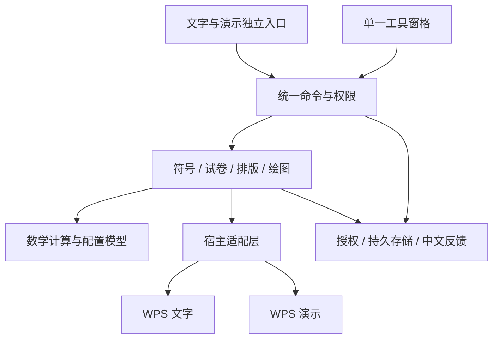

# WPS 高中数学插件重构与功能升级方案

日期：2026-09-13  
基线：当前工作目录中的 WpsHighSchoolMath 0.5.3  
状态：总体路线草案。方案编写时未修改功能代码；后续已授权的 0.6.0 函数绘图实施进度见同目录 implementation.md。

## 1. 建议方向

将现有插件逐步升级为面向高中数学老师的离线备课工具，围绕“制作试卷、绘制数学图形、制作课件”组织功能。保留当前离线安装、无账号、无业务服务器和手动激活流程。

实施顺序：建立可恢复基线 → 文档保护与模块拆分 → 高频操作优化 → 函数绘图升级 → 组卷工作流 → 经实机验证的公式与几何扩展 → 正式发布验收。

优先保证 Writer 备课与制卷体验；PPT 共享符号、绘图和授权能力，并保留独立的插入与布局逻辑。新增功能的商业权限在实施前逐项确定，沿用现有收费规则作为默认建议。

## 2. 本轮核实的现状

| 项目 | 当前事实 | 对方案的影响 |
| --- | --- | --- |
| 版本与功能 | package.json 为 0.5.3；具有 Writer/PPT 双入口、符号、Writer 试卷模板与排版、函数绘图、离线授权 | 现有功能可作为迁移基线 |
| 绘图 | 已有表达式解析、SVG 输出、多曲线、配置回读、原位更新和 PPT 自动避让 | 二次编辑与自动布局属于已有能力，升级应在此基础上增强 |
| 界面 | 绘图与授权复用一个工具窗格，具备就绪握手和失败回退 | 继续扩展现有单窗格体系 |
| 授权 | HSM2、Ed25519 公钥验证、14 天试用；到期后保留现有 Writer 试卷模板命令及授权入口 | 重构必须保持旧码、机器码、试用起始日和权限兼容 |
| 安装 | 已有双宿主载荷清单、安装验证、失败回滚和卸载注册 | 保留并补充迁移验收 |
| 自动测试 | 本轮实际运行 tests 下全部 13 项 JavaScript 测试，全部通过 | 可以建立行为基线；这些测试包含模拟宿主和静态检查，不代表 WPS 实机全部通过 |
| 发布包 | 当前 0.5.3 清单为 Internal / internal-test / pending-certificate；本轮读取现有 EXE 的签名状态为 NotSigned | 正式发布需完成项目既定签名门禁 |
| 版本管理 | git log 确认当前 master 尚无提交；源码在 git status 中为未跟踪文件 | 重构前必须建立源码快照与首个可信提交 |

验证边界：本轮没有重新构建安装包，没有执行完整 PowerShell 测试，也没有操作 WPS 验证界面和文档效果；没有逐文件完成安全审计。下述风险来自已读取代码，应在实施阶段通过针对性测试验证。

## 3. 应优先解决的问题

### 3.1 文档操作失败时保护原内容

`js/function-plot-document.js` 中，Writer 和 PPT 的更新路径均先调用旧图的 Delete，再调用 AddPicture。由调用顺序可推断：若添加新图失败，旧图可能已丢失。Writer 新建图像路径还会清空选区文本，需要明确替换范围和恢复策略。

建议先完成输入、文件和目标文档校验；对目标 WPS 能力做小范围验证后，采用“成功生成新对象并检查后再提交替换”的流程。若宿主无法可靠实现原位替换，则提供插入新图的可恢复路径。不得仅靠捕获错误或显示成功消息假定文档已恢复。

验收：模拟图片插入失败、元数据写入失败、目标文档切换、文档关闭和重复点击；原图/原文仍在，结果准确，不误改其他文档。撤销合并只在相应 WPS API 实测通过后启用。

### 3.2 将功能区回调与业务功能分开

`js/ribbon.js` 当前约 510 行，集中包含命令映射、模板文字、权限、宿主读取、试卷和排版。`ui/function-plot.js` 同时处理界面、选区监测、临时文件和文档插入。

建议按职责拆分，功能区只负责分发命令；界面只负责输入和反馈；业务逻辑不直接访问 WPS 全局对象。避免仅按文件长度机械拆分。

### 3.3 统一命令与授权规则

当前命令、付费名称和到期放行列表分别维护。建议建立命令目录，描述命令编号、中文名称、支持宿主、处理器和权限类别；所有入口，包括任务窗格中的最终执行操作，都经过同一权限校验。

迁移初期保留现有 Ribbon XML，先验证新命令目录与现有按钮的一致性。确有维护收益后，再决定是否由配置生成部分 XML。

### 3.4 区分临时通信与持久数据

现有授权代码使用 localStorage、PluginStorage 和安装器提供的机器码文件，应先补齐读写与恢复的行为契约。WPS 官方明确 PluginStorage 不持久化，因此新增收藏、模板和题库不能只存放在这里。[WPS PluginStorage 文档](https://open.wps.cn/documents/app-integration-dev/wps365/client/wpsoffice/jsapi/addin-api/PluginStorage/obj)

先保留现有授权存储路径，通过包装层逐步统一调用；新增个人数据采用经实测支持的文件/存储能力、版本号和备份机制。Writer/PPT 跨宿主读取、重启和升级均需验证，不假设二者天然共享 localStorage 或任意系统目录权限。

### 3.5 保留兼容经验与验证证据

`main.js` 的同步加载是已有旧版 WPS 兼容措施。历史原生窗口/桥接探针存在失败证据，不能将其直接纳入产品方案。`specs`、`probes`、`migration` 和旧版测试夹具应先标注用途及有效状态，再决定归档方式。

任务窗格页签与绘图选区监测目前各使用 250ms 轮询。可统一管理定时器生命周期，在页签隐藏或无文档时减少无效检查；实际性能改善需测量，不能仅凭轮询间隔认定存在卡顿。

## 4. 目标结构

建议先在现有目录内渐进新增模块：

| 层次 | 建议职责 | 主要依赖 |
| --- | --- | --- |
| entry | 保留根目录及 ppt 的独立启动顺序、全局 Ribbon 回调 | 命令目录、初始化 |
| core | 命令分发、权限、错误结果、配置版本 | 存储接口、宿主能力接口 |
| features | symbols、exam、formatting、plot；后续 formula、geometry | core、数学模型、宿主接口 |
| adapters | Writer/PPT 选区、文档写入、图形插入、存储 | WPS API；独立承担版本差异 |
| ui | 输入、预览、状态反馈、单窗格导航 | 功能服务；不直接编排文档修改 |
| scripts/tests | 离线构建、白名单、安装回滚、发布与行为验证 | 实际交付文件清单及入口契约 |

技术选择建议：首轮沿用当前原生 JavaScript 和静态页面，为模块接口增加 JSDoc 与清晰的数据定义。需要类型检查或编译时，再以一个纯计算模块试点 TypeScript；输出仍需满足现有 WPS 加载方式与离线要求。界面框架是否引入，由复杂度和实机兼容验证决定，不与首轮模块拆分绑定。

## 5. 功能升级清单

### 第一优先：老师每天都能用到的改进

| 功能 | 具体升级 | 首版验收范围 |
| --- | --- | --- |
| 常用工具 | 符号中文搜索、最近使用、个人收藏；常用命令入口 | 搜索“垂直”能找到对应符号；重启后收藏保留 |
| 自定义模板 | 自定义卷头、题型标题、题号起点、选项布局；保存个人预设 | 保存并再次套用同一模板，旧版模板仍可用 |
| 排版助手 | 常用试卷样式、选区处理、执行前说明作用范围、失败反馈 | 操作限制在指定范围；正文、页眉和公式等内容不被无意改变 |
| 绘图易用性 | 每条曲线独立颜色/线型、错误定位、黑白打印预设、尺寸预设 | 某条表达式错误可定位并修正；预览与插入结果一致 |
| 使用帮助 | 首次使用示例、功能内简短说明、环境诊断导出 | 老师可以按页面提示完成首次插入与激活；诊断不包含文档正文或激活码 |

第一轮界面继续保留一个“高中数学”功能区和一个工具窗格。快速插入留在功能区，需要参数的操作集中到窗格。新增导航采用配置管理，替换当前仅针对两个页签的固定切换逻辑。

### 第二优先：函数绘图增强

- 每条曲线的定义域、分段函数与区间端点设置。
- 点、坐标标签、辅助线、渐近线；交点或极值等结果采用明确的数值算法和适用范围，不宣称完整符号求解。
- 参数函数先做固定参数取值预览，再评估参数滑块；课堂动态演示作为后续能力。
- 改善间断点、高曲率处的采样；对反比例、正切、根式边界和窄区间建立数学案例测试。
- 延续 SVG 与配置保存机制，支持个人图像预设、配置导入导出和再次编辑。

验收重点：间断点不产生错误连线，分段端点开闭表达正确，旧版图像配置仍能读取；预览、Writer 插入和 PPT 插入采用一致的绘图模型。

### 第三优先：完整组卷流程

建议按“模板制卷 → 本地题目收藏 → 本地组卷”分三步交付，逐步验证文档内容的保真。

1. 模板制卷：设置试卷名称、题型、题数、分值、答题空间与页面样式，生成可编辑骨架。
2. 题目收藏：保存老师自行选取的题目，补充章节、知识点、难度、题型、答案和解析；提供备份与恢复。
3. 本地组卷：筛选题目、加入试卷、调整顺序、计算总分，并生成学生卷和教师解析卷。

题目建议包含 id、数据版本、题型、知识点、题干引用、答案、解析、图形资源和来源备注。先验证 WPS 对富文本片段、公式和图片的保存/恢复能力，再选择具体存储格式；数据落盘与断电恢复验证通过后才开放题库写入。

首版范围：老师手动收录与确认结构的题目；普通题型的组卷和总分检查。复杂试卷自动解析、图片识题、自动拆解所有 Word 文档属于单独扩展。

验收：包含公式、图片、表格的代表性题目保存后不丢内容；重启后仍在；重新排序后题号与答案一致；学生卷不出现解析；损坏导入不覆盖现有题库。

### 条件优先：原生公式与几何

**原生可编辑公式**：当前 README 明确以符号和文档工具为主，不插入公式对象。此项属于新增能力。WPS 官方文档提供 OMaths.Add 与 BuildUp 示例，可以先验证分数、根式、上下标、求和等常见公式。[WPS OMaths.Add 文档](https://open.wps.cn/documents/app-integration-dev/wps365/client/wpsoffice/jsapi/wps/OMaths/member/Add)

文档中存在接口不等于所有客户版本都可用，也不等于支持任意 LaTeX。先在 Writer 验证插入、编辑、保存重开、复制和打印；PPT 单独验证。能力不满足时，该功能保持未支持状态，保留现有符号操作。

**几何绘图**：先做坐标系、点线、圆、三角形及角度/长度标签的参数化模板；通过参数重新编辑并输出 SVG。自由拖动、几何约束联动、立体几何和动画在基本模型稳定后另立阶段。

**联网 AI 与云题库**：保留为未来可选产品方向，需要独立确定费用、联网条件与资料处理方式，不计入本方案默认实施范围。

## 6. 实施阶段与通过条件

以下版本号表示建议里程碑，实际发布号以之后确认的范围为准。

| 阶段 | 交付内容 | 通过条件 | 前置条件 |
| --- | --- | --- | --- |
| P0 基线 | 源码快照、首个提交、功能清单、旧文档样本、兼容矩阵、当前构建与测试记录 | 能从独立目录复现当前内部包；能恢复基线；授权私钥与发码历史保持发行方独立保管 | 无 |
| P1 / 0.6 | 文档保护、模块接口、命令权限统一、宿主适配、存储包装 | 旧功能行为一致；失败注入不丢原内容；旧授权与图像可用；双宿主加载成功 | P0 |
| P2 / 0.7 | 常用工具、自定义模板、界面反馈和绘图基础增强 | 代表性老师任务可独立完成；预设持久化；打印与插入一致 | P1 |
| P3 / 0.8 | 分段函数、标注、采样改进、模板制卷 | 数学案例、复杂版式和旧文档往返检查通过 | P2、对应模型与 API 验证 |
| P4 扩展 | 本地题目收藏/组卷；或公式/几何模块 | 每个模块先通过存储/宿主能力验证，再做完整功能验收 | 按教师试用反馈选一条主线 |
| 1.0 发布 | 选定功能稳定、双宿主兼容回归、签名包、升级/卸载验收、简明使用说明 | 全部发布门禁通过，并完成代表性教师试用问题闭环 | 已选里程碑全部通过 |

建议先将 P0—P2 作为第一批实施范围。它可以独立交付稳定性、维护性和易用性改善。P3/P4 的范围根据第一批使用反馈确定；达到 1.0 不要求同时完成所有远期功能。

## 7. 文件改造顺序与依赖

| 当前文件/目录 | 拟变更 | 依赖和注意点 |
| --- | --- | --- |
| js/ribbon.js、js/ribbon-ppt.js | 提取命令、试卷、排版与宿主调用；保留全局回调 | 先定义命令/宿主接口，再迁移具体实现；保持现有命令 ID |
| js/plotter.js | 按表达式解析、采样、SVG 输出划分内部边界 | 先记录现有数学结果，再加新语法；UI 与文档层共用同一模型 |
| js/function-plot-document.js、js/ppt-api.js | 提取双宿主插入/更新适配和恢复逻辑 | 文档保护优先于功能扩展；保留 PPT 避让算法 |
| js/taskpane.js、ui/tool-center.* | 统一页签配置、就绪检查和定时器生命周期 | 继续保留版本化页面、单例和失败回退 |
| ui/function-plot.js、js/function-plot-native.js | 界面与绘图服务解耦；保持回退入口 | 使用同一参数校验、权限和插入结果 |
| js/license.js | 包装存储与权限接口，明确跨宿主/重启行为 | 不更换既有签名密钥、HSM2 格式、试用规则或旧存储键 |
| main.js、ppt/main.js、HTML 入口 | 随模块拆分调整确定的脚本顺序 | 每次变更在目标 WPS 实机验证同步启动与回调 |
| scripts/build-offline.ps1、scripts/zero-loopback-policy.js、scripts/payload-integrity.ps1 | 同步新模块白名单、版本化页面及交付清单 | 与源码变更同批提交，避免本地正常但安装包缺文件 |
| tests、migration、probes、specs | 增加行为/故障测试，标注现行方案及历史证据 | 保留被引用的夹具和兼容证据，按用途归档 |
| README.md、HANDOFF.md、CLAUDE.md | 同步最终入口、文件职责、能力范围与验证步骤 | 以当前实现和实测结果为依据，解决历史描述漂移 |

## 8. 可执行任务清单

- [ ] T1：保存可恢复源码快照，核对忽略项和敏感文件边界，建立基线提交。（P0）
- [ ] T2：从独立工作目录构建 0.5.3 并运行完整测试；记录现有 Writer/PPT 环境和文档样本。（P0）
- [ ] T3：定义 Command、HostAdapter、PlotConfig、StorageAdapter 与 OperationResult 的数据及接口约定。（P1）
- [ ] T4：补充图片替换失败的回归案例，修复文档保护，再验证两宿主行为。（P1）
- [ ] T5：逐组迁移符号、试卷、排版和绘图入口；同步执行权限与加载/打包契约。（P1）
- [ ] T6：包装现有授权存储，验证升级、重启、双宿主与重装；加入个人设置的存储与备份。（P1/P2）
- [ ] T7：交付中文搜索、最近使用、收藏和自定义模板，整理单窗格导航与反馈。（P2）
- [ ] T8：交付曲线样式、打印预设与表达式错误定位；完成预览/插入/旧配置回归。（P2）
- [ ] T9：按选定范围交付分段函数、标注和模板制卷。（P3）
- [ ] T10：根据试用反馈选择题库组卷或公式几何；先完成关键 API 与数据保存验证。（P4）
- [ ] T11：完成签名、升级失败恢复、安装卸载、兼容矩阵与教师试用验收。（1.0）

## 9. 数据兼容与回退

1. **代码回退**：每个阶段独立提交，保存对应安装包、文件清单、哈希与验证记录。当前没有提交，必须先完成 P0，不能假设现成的 Git 回退点已经存在。
2. **授权兼容**：继续验证 HSM2，保留签名公钥和旧数据读取路径；升级前后机器码、试用起始日和有效授权一致。普通重装仍不重置试用。新增付费功能单独配置，不扩大现有免费白名单的含义。
3. **绘图兼容**：继续读取 HSM_FUNCTION_PLOT_V1。新增字段需要显式版本迁移与默认值；写入新格式前保存恢复信息。旧插件可能不能编辑新版专有配置，降级必须明确此限制，并保证文档图像仍可见且配置可导出。
4. **题库兼容**：读入旧版本 → 验证 → 备份 → 写入新版本 → 校验完成后切换。未知版本或损坏数据不能覆盖原库；恢复能力通过后再投入使用。
5. **安装回退**：沿用现有安装事务，失败恢复两个宿主目录和注册；新增个人资料与授权数据独立于安装载荷，回滚安装不得误删用户资料。

## 10. 验收安排

- **逻辑与数学测试**：表达式、权限、模板、配置迁移与题号/分数一致性。
- **宿主边界测试**：无文档、选区变化、文档关闭、API 异常、只读文档、重复操作和不支持能力。
- **交付测试**：先构建当前版本，再运行完整现有测试；检查白名单、实际载荷、安装/回滚/卸载和发布签名。
- **实机验证**：覆盖文档所记载的旧环境、当前开发环境及教师常用环境；先实际采集版本与位数，再公布支持列表。
- **文档往返**：保存并重开包含公式、图片、表格、分栏和页码的样本；查看打印/导出效果；确认旧文档与旧图像仍正常。
- **教师试用**：建议邀请 3—5 位老师完成“制作一张练习卷、修改一张函数图、在课件插入图形、重启后继续使用”四项任务，记录完成时间、卡点和错误；测试目标数值在取得当前基线后确定。

## 11. 本方案采用的默认假设

- 继续面向非技术高中数学老师，优先离线、低学习成本和本机数据。
- 第一批以稳定性、易用性和现有功能增强为主，题库、公式和几何按验证结果分阶段进入。
- 默认延续现有试用与授权规则；新功能的套餐归属、永久版更新范围和支持的最低 WPS 版本仍需在实施范围确定时明确。
- 保留完整离线包升级。联网更新若后续需要，再单独设计与评估。
- 此处是产品与技术方案，不是交付日期承诺；工期应在选定 P0—P2 具体功能和完成兼容基线后估算。

## 12. 依据

- 当前源码与文件：package.json、README.md、HANDOFF.md、CLAUDE.md、main.js、js/ribbon.js、js/ribbon-ppt.js、js/plotter.js、js/function-plot-document.js、js/license.js、ui/function-plot.js、ui/tool-center.js、scripts/build-offline.ps1、scripts/run-tests.ps1。
- 当前发布资料：release/WpsHighSchoolMath-0.5.3-release-manifest.json，以及现有 0.5.3 EXE 的 Authenticode 状态。
- 当前检查：git status、git log，以及 13 项 JavaScript 自动化测试的本轮结果。
- 历史工程证据：specs/scheme-c-native-function-editor/evidence/wps-native-capability-12.1.0.26895-scheme-one-inproc-failed.md，仅用于说明历史路线的验证结果，不代表当前全部 WPS 版本能力。
- 前期产品约定：离线使用、面向数学老师、14 天试用及到期保留 Writer 试卷模板；本轮已与工作区说明及对应实现交叉核对。
- 官方 API 文档：上文所引 PluginStorage、OMaths.Add，查询日期为 2026-09-13；实际可用性仍以目标版本实测为准。
