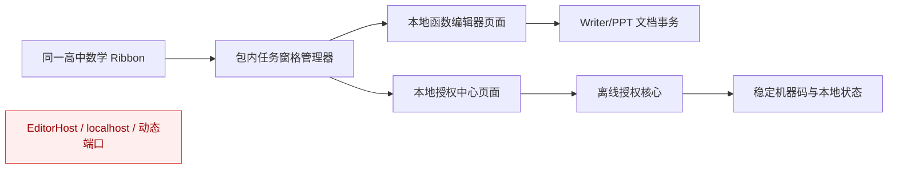

# 方案 B：包内静态任务窗格技术设计

状态：已确认并进入实施（2026-07-18）  
对应需求：[requirements.md](./requirements.md)

## 1. 设计结论

正式插件继续使用 WPS JS 加载项和任务窗格，但任务窗格只加载当前安装载荷内的静态页面。旧 EditorHost、动态端口、健康检查 HTTP 请求和回环 ready 接口全部删除。

## 2. 本地 URL 与边界

- Ribbon 从自身 `document.location` 取得插件根 URL。
- `MathTaskPanes.openPackaged()` 只接受逻辑页面名 `function-plot` 或 `license`，在内部映射到版本化白名单路径。
- 允许的根协议只有 `file:`；页面必须位于同一插件根目录，不接受调用方传入完整 URL。
- 路径经过固定映射，不允许 `..`、反斜杠、协议分隔符、查询中覆盖宿主角色或远程资源。
- UI 页面只引用相对静态资源；HTML 中的 `src`、`href`、表单地址和运行时 DOM URL setter 都由零网络策略测试覆盖。

## 3. 就绪握手

1. Ribbon 生成随机 ready token，并在 `PluginStorage` 清空对应 ready key。
2. 创建版本化本地任务窗格 URL，附加 `hsmPane`、`hsmToken` 与只读 `hsmHost`。
3. 页面完成 DOM 和事件绑定后调用 `MathTaskPanes.signalReady()`。
4. 页面从查询参数读取 token，并写入同一加载项的 `PluginStorage`。
5. Ribbon 在固定超时内核对 token；失败时隐藏并重建一次，第二次失败才进入无网络降级。

握手不持久化、不包含激活码，不使用 XHR、fetch、WebSocket 或任何监听器。

## 4. 模块调整

| 模块 | 调整 |
|---|---|
| `js/taskpane.js` | 删除端口、健康检查、ShellExecute 和 EditorHost；新增受限的 `openPackaged()` |
| `js/ribbon.js` / `js/ribbon-ppt.js` | 函数编辑器调用 `openPackaged()`；保留无网络快捷函数降级 |
| `js/license.js` | 授权中心调用 `openPackaged()`；失败仅返回错误，不以系统提示框代替正式流程 |
| `ui/function-plot.*` | 保留完整编辑器、预览、文档插入与元数据更新 |
| `ui/license.*` | 增加微信号文本及复制按钮，保留机器码、激活码和到期状态 |
| `runtime/**` | 从正式源码白名单、构建、清单和安装后目录移除 |
| 构建/安装/校验 | 删除运行时编译与 runtimeHost 清单，新增本地页面白名单和零网络断言 |

## 5. 版本化页面

构建仍生成 `function-plot-<version>.html` 与 `license-<version>.html`，避免 WPS Chromium 缓存旧页面。根页面只负责 Ribbon 回调，不承担任务窗格跳转。Writer/PPT 各自载荷包含同样的 `ui`、`js` 与必要 assets 文件。

## 6. 授权与状态

- 继续使用现有 `js/license.js` 的离线校验和兼容读取逻辑。
- `%APPDATA%\WpsHighSchoolMath\machine-id.txt` 仍是安装器注入机器码的权威来源。
- `PluginStorage` 只承担同一加载项会话内 ready 和状态同步；持久状态不依赖它单独存在。
- UI 不记录或回显已提交激活码，错误日志不得包含完整输入。

## 7. 构建与升级

- 0.4.0 构建白名单不包含 `entry.js` 的旧分流模式、`runtime`、EditorHost 或任何原生探针。
- 安装器保留“停止遗留 EditorHost”作为一次性升级清理步骤，但不再包含启动逻辑。
- Writer/PPT 注册切换继续采用现有事务、哈希 compare-and-swap 与失败回滚规则。
- 商业发布清单声明 `localHttp=false`、`auxiliaryExecutables=false`、`webTaskPanes=true`、`taskPaneSource=packaged-file`。

## 8. 验证

- 单元：白名单 URL、token、重建一次、失败只回调一次、拒绝远程/越界 URL。
- 静态：禁止 localhost、回环地址、ShellExecute、EditorHost、网络 API 和远程 DOM URL。
- 构建：精确文件集合、版本化页面、UTF-8、安装器资源哈希。
- 实机：Writer/PPT 冷启动、函数页、授权页、复制粘贴、插入/更新、进程与 TCP 采样。

## 9. 依据

- WPS 官方 `Application.CreateTaskPane(url, title?)` 用于创建嵌入式网页任务窗格。
- WPS 官方 `TaskPane.Navigate(url)` 说明任务窗格 URL 可以是本地 HTML 资源。
- WPS 官方 `PluginStorage` 用于同一加载项多个页面之间共享简单数据，但不作为长期持久化存储。
