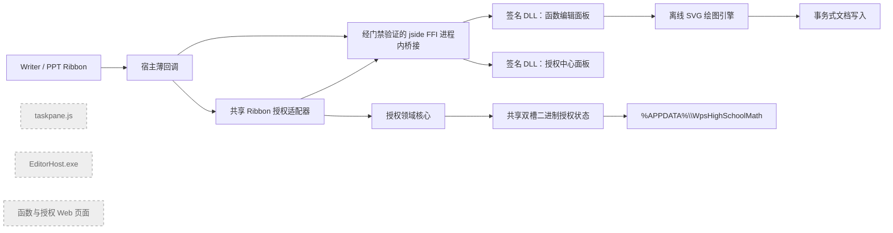

# 方案 C：全插件无 localhost 技术设计

状态：方案一兼容性硬门禁失败（2026-07-18，当前 WPS `12.1.0.26895` 不可实施）  
目标版本：0.4.0  
对应需求：[requirements.md](./requirements.md)

## 1. 设计结论

0.4.0 的条件设计继续采用 WPS JS 加载项，并增加一份 Writer/PPT 共用的签名 x86 原生桥接 DLL。该设计只有在目标 WPS 构建通过第 10 节硬门禁后才能实施；当前 `12.1.0.26895` 已于 2026-07-18 失败：

- 函数编辑器使用 DLL 提供的单窗口 Windows 模态编辑面板。
- 数学符号、函数工具、试卷工具和授权中心统一使用同一“高中数学”Ribbon Tab，仅按 group 分区，不新增第二个 Tab。
- Writer/PPT 通过固定 AppData 下的共享 A/B 二进制封套读取同一机器码、试用期和激活状态。
- 授权区以 Ribbon 按钮打开 DLL 提供的正式 Windows 原生授权面板。
- 在已通过门禁的 WPS 构建上，JavaScript 使用 WPS 官方 `jside FFI` 的 `ffi.LoadLibrary()` 按安装目录绝对路径加载 DLL；DLL 在 `wps.exe`/`wpp.exe` 进程内运行，不注册 WLL，不启动外部进程，也不依赖 NativeX SDK。当前构建没有暴露该能力，不能套用此条件设计。
- 不再启动页面助手、不监听端口、不创建 Web 任务窗格，也不调用浏览器 `prompt()`。
- 构建载荷采用明确白名单，禁止旧 Web 页面、任务窗格脚本和辅助 EXE 混入。

WPS 加载项引擎仍会从安装目录读取自身 `index.html` 和 JavaScript。这属于宿主加载机制，不是 localhost 或网络服务。

## 2. 总体架构



运行时不再存在端口选择、页面助手健康检查、ready 握手、任务窗格 ID 缓存或 Web 降级路径。

## 3. 模块边界

| 模块 | 责任 | 主要变化 |
|---|---|---|
| `js/license-storage.js` | UTF-8/Base64 ASCII 封套、二进制双槽读写、结构校验、revision 恢复和旧存储候选采集 | 新增；授权强度比较由领域层注入，不在存储层重复实现 |
| `js/license.js` | 机器码、试用期、激活码校验、状态、门禁、提醒条件、联系方式 | 删除所有任务窗格和 URL 逻辑 |
| `js/native-dialog-bridge.js` | `jside FFI` 能力探测、绝对路径加载、ABI/协议校验、调用与敏感返回值清理 | 新增；Writer/PPT 共用；只加载白名单 DLL |
| `native/HsmMathNativeBridge.dll` | Windows 原生函数编辑器和授权中心模态面板 | 新增；x86、进程内、Authenticode 签名；不含业务判定和持久化 |
| `js/license-ribbon.js` | 动态标签、打开授权中心、非敏感反馈与 Ribbon 刷新 | 新增；Writer/PPT 共用；不保存激活码草稿 |
| `js/function-plot-native.js` | 调用原生面板、复验返回配置并驱动绘图 | 成为唯一正式函数编辑入口 |
| `js/function-plot-document.js` | 元数据、选中图识别、Writer/PPT 插入和更新 | 更新改为事务式替换 |
| `js/plotter.js` | 表达式编译和离线 SVG 生成 | 保留现有引擎 |
| `js/ppt-api.js` | PPT 活动页、页面尺寸和内容避让 | 保留现有算法 |
| `js/ribbon.js` / `js/ribbon-ppt.js` | WPS 全局回调、宿主文档操作、命令分发 | 只桥接共享授权与函数模块 |
| `ribbon.xml` / `ppt/ribbon.xml` | 同一“高中数学”Tab 的原生控件声明 | 扩展原生授权分组 |
| 构建、安装与验证脚本 | 白名单打包、旧版迁移、发布门禁 | 反转原有 localhost 依赖断言 |

删除正式实现：

- `js/taskpane.js`
- `runtime/WpsHighSchoolMathEditorHost.cs`
- `entry.js`
- `ui/function-plot.*`
- `ui/license.*`
- `assets/wechat-qr.*`
- 对应页面助手和 Web UI 测试

历史方案文档和升级测试夹具可保留，但不能进入正式载荷。

## 4. 插件启动与加载顺序

Writer/PPT 的 `index.html` 直接加载各自 `main.js`，删除 `hsmMode=function-plot` 分流。为兼容当前 WPS，继续用 `document.write` 保证同步顺序。

Writer：

```text
symbols.js
→ license-storage.js
→ license.js
→ native-dialog-bridge.js
→ license-ribbon.js
→ plotter.js
→ function-plot-document.js
→ function-plot-native.js
→ ribbon.js
```

PPT：

```text
symbols.js
→ ppt-api.js
→ license-storage.js
→ license.js
→ native-dialog-bridge.js
→ license-ribbon.js
→ plotter.js
→ function-plot-document.js
→ function-plot-native.js
→ ribbon-ppt.js
```

共享模块在宿主回调前同步加载；任一共享脚本语法错误都会导致整个 Ribbon 失效，因此源文件、构建载荷和安装后文件都必须执行 JavaScript 语法检查，并保持 UTF-8 无 BOM 写入。

## 5. 原生函数编辑器

### 5.1 正式流程

点击“函数编辑器”后按以下顺序执行：

1. 宿主检查授权；无权时仅引导到 Ribbon 授权区，不修改文档。
2. 读取当前是否恰好选中带 `HSM_FUNCTION_PLOT_V1` 元数据的函数图像。
3. `MathNativeDialogBridge` 校验 WPS 构建、`ffi` 能力、DLL 绝对路径、桥接 ABI 版本和 DLL Authenticode 状态。
4. JavaScript 把所选配置或默认配置序列化为不含文档内容的版本化 JSON，调用 `HsmOpenFunctionEditor()`。
5. DLL 在当前 WPS 进程中打开一个有宿主父窗口的模态 Win32 面板，同时展示表达式、x/y 范围和四项显示设置；支持中文分号、英文分号和换行。
6. 用户取消时 DLL 返回 `cancel`，清空内部结果缓冲区；JavaScript 不生成文件、不修改文档。
7. 用户确认时 DLL 返回版本化 JSON；JavaScript 使用现有 `FunctionPlotter.compileExpression()` 和 `MathFunctionDocument.normalizeConfig()` 再次完整校验，绝不信任 DLL 返回值。
8. 复验通过后生成唯一临时 SVG，事务式插入或更新文档。
9. 无论成功、失败或取消都清理临时文件，并调用 `HsmClearSensitiveResult()` 清空 DLL 的返回缓冲区。

DLL 只负责输入体验，不直接调用 WPS 文档对象，不生成 SVG，也不保存配置草稿。

### 5.2 旧版降级

若 `jside FFI`、DLL 签名/架构或桥接协议不可用，进入现有四函数快捷流程：

- `x^2`
- `1/x`
- `sin(x)`
- `cos(x)`

快捷流程采用各自默认范围和四项全开设置，不调用 Web 编辑器。若原生确认框也不可用，则明确报“不支持原生函数选择”，不再继续。

### 5.3 配置与元数据

继续使用当前配置结构和元数据前缀，不引入不兼容版本：

```json
{
  "expressions": ["x^2", "sin(x)"],
  "bounds": { "xMin": -10, "xMax": 10, "yMin": -10, "yMax": 10 },
  "options": {
    "showTickLabels": true,
    "showGrid": false,
    "showBorder": true,
    "showLegend": true
  }
}
```

已插入的 0.3.x 函数图像仍可被 0.4.0 读取和重新编辑。

## 6. 事务式图像更新

### 6.1 Writer

更新所选内嵌图像时：

1. 保存旧图对象、起始位置、宽高和元数据。
2. 在旧图起始位置创建折叠插入范围，但暂不删除旧图。
3. 插入新图，写入新元数据并恢复目标尺寸。
4. 新图全部成功后删除旧图。
5. 若删除旧图失败，删除新图并保留旧图；即使回滚新图失败，也优先保证旧图仍存在。

新建插入时不再先清空用户选中文字；使用折叠范围插入，避免 `AddPicture` 失败造成文字丢失。

### 6.2 PPT

更新所选形状时：

1. 保存旧图的 `Left/Top/Width/Height` 和元数据。
2. 在相同几何位置插入新图，但暂不删除旧图。
3. 写入元数据、名称并验证新图。
4. 成功后删除旧图并选中新图。
5. 任一步失败时删除新图，保留旧图及其位置尺寸。

新建图像继续调用 `WpsPptApi.findBestPlacement()`，拥挤页面选择边界内重叠最小的位置。

## 7. 原生 Ribbon 授权中心

### 7.1 控件策略

Writer/PPT 在各自现有“高中数学”Tab 末尾使用相同控件 ID，不新增授权 Tab。正式授权区只依赖已通过实机探针的 `group`、`button`、动态 `getLabel`、`onAction` 和 Ribbon 刷新，不再使用 `editBox`。

| 控件 ID | 类型 | 展示或行为 |
|---|---|---|
| `auth_status` | 动态按钮 | `试用中 · 14天体验`、`已激活 · 年卡` 或 `已到期` |
| `auth_expiry` | 动态按钮 | 到期日期和剩余天数 |
| `auth_access` | 动态按钮 | 全部功能可用或当前受限范围 |
| `auth_machine_code` | 动态按钮 | 显示完整机器码，不承担文本编辑 |
| `auth_copy_machine` | 按钮 | 自动复制机器码 |
| `auth_open_center` | 按钮 | `打开授权中心`；打开签名 DLL 提供的正式原生面板 |
| `auth_qq` | 按钮 | `QQ 982303035（复制）` |
| `auth_wechat` | 按钮 | `微信 qzt65631（复制）` |
| `auth_feedback` | 动态按钮 | 最近一次成功、失败或兼容提示，不包含激活码 |
| `auth_refresh` | 按钮 | 强制从共享状态刷新 |

Ribbon 不依赖 `editBox`、`dialogBoxLauncher`、Gallery、二维码或复杂自定义图片。动态标签只显示摘要；完整交互集中在原生面板。

`MathNativeDialogBridge.openAuthorizationCenter()` 按下列顺序工作：

1. 从 `MathLicense.getStatus()` 读取非敏感状态，并构造只包含状态、授权类型、到期日、剩余天数、机器码、QQ 和微信号的版本化 JSON。
2. 通过 `ffi.LoadLibrary(absoluteDllPath, declarations)` 加载白名单 DLL，调用 `HsmGetBridgeVersion()`、`HsmGetCurrentProcessId()` 和 `HsmOpenAuthorizationCenter(statusJson)`。
3. DLL 使用当前前台 WPS 顶层窗口作为所有者，显示真正模态的 Win32 面板；复制操作在 DLL 内完成，激活码输入支持 `Ctrl+V`。
4. 用户取消时只返回 `cancel`；用户确认激活时返回 `submit` 和临时码值。DLL 不验证、不写文件，也不记录码值。
5. JavaScript 取回结果后立即调用 `HsmClearSensitiveResult()`，再在当前调用栈内验证和保存；桥接错误时显示兼容性原因，禁止改用浏览器 `prompt()`、`Application.ShowDialog`、`CreateTaskPane` 或外部程序兜底。

### 7.2 回调与激活协议

Writer/PPT 提供相同全局签名并委托给 `MathLicenseRibbon`：

```text
OnAuthorizationAction(control)
OnAuthorizationGetLabel(control)
OnAuthorizationGetEnabled(control)
OnAuthorizationGetVisible(control)
```

授权 Ribbon 适配器只保存非敏感会话反馈：

```text
feedbackKind
feedbackShortText
feedbackFullText
clipboardBusy
```

激活码不得进入上述会话对象。点击 `auth_open_center` 后的流程是：

1. 以当前授权摘要打开原生面板，激活码输入框始终为空；不得回填上次失败内容或现有有效激活码。
2. 用户取消时立即返回，不调用授权核心，不写文件、不增加 revision、不刷新或改变授权状态，也不改变既有反馈。
3. 用户确认后，只在当前调用栈的局部变量中规范化、校验并调用 `MathLicense.activate(code)`；错误对象和反馈不得拼接原始或规范化激活码。
4. 激活失败时丢弃局部输入、显示不含码值的具体原因并保留原授权；不得写日志、宿主存储、状态文件、DLL 缓冲区或持久草稿。
5. 激活成功且二进制共享状态回读成功后，丢弃局部输入并刷新状态、到期和权限；最终无论成功失败都在 `finally` 中清除 JavaScript 和 DLL 对该局部值的引用。

授权有效性始终以 `MathLicense.getStatus()` 和共享离线状态为准，不把 UI 缓存作为权威状态。

### 7.3 Ribbon 刷新

统一刷新顺序：

1. 优先逐个调用 `ribbonUI.InvalidateControl(id)`。
2. 不可用时调用 `ribbonUI.Invalidate()`。
3. 最后回退到 `Application.UpdateRibbon()`。

getter 回调内部不得触发刷新，避免递归。

### 7.4 剪贴板

复制机器码、QQ 和微信号采用：

1. `navigator.clipboard.writeText()`。
2. 失败后在加载项隐藏页面使用临时 `textarea + document.execCommand("copy")`。
3. 再失败时打开原生授权面板的只读复制区域并选中完整值，提示 `Ctrl+C`；若原生桥接也不可用，则用原生提示显示完整值并说明只能手工记录。

原生授权面板不主动读取剪贴板，也不把剪贴板内容写入页面或缓存；它只允许用户在空白输入框主动按 `Ctrl+V`。复制命令与激活提交必须使用不同控件和返回动作，禁止把机器码或联系方式误送入激活校验。任何模式都不得调用浏览器 `prompt()`、外部程序或 Web 对话框。

## 8. 授权核心与共享状态

### 8.1 分层接口

`MathLicenseStorage`：

```text
loadSlots(machineId)
readMigrationCandidates(machineId)
commit(machineId, nextState, now)
```

`MathLicense`：

```text
getMachineId()
getStatus(options)
activate(code)
validateLicenseCode(code)
checkFeature(featureName)
getReminder(now)
markReminderShown(date)
getContact()
mergeStateCandidates(candidates, now)
```

`checkFeature()` 只返回结构化结果，不弹窗、不操作 Ribbon。门禁提示和每日提醒由 `MathLicenseRibbon` 展示。

联系方式固定为：

```json
{ "qq": "982303035", "wechat": "qzt65631" }
```

### 8.2 双槽文件

机器码继续使用：

```text
%APPDATA%\WpsHighSchoolMath\machine-id.txt
```

共享授权状态使用两个槽：

```text
%APPDATA%\WpsHighSchoolMath\license-state-v1.a.bin
%APPDATA%\WpsHighSchoolMath\license-state-v1.b.bin
```

采用双槽是因为 WPS 文件接口没有可确认原子性的重命名操作；写入中断时仍可读取上一槽。两个槽都必须使用完整固定 AppData 路径调用 `FileSystem.writeAsBinaryString()` 和 `FileSystem.readAsBinaryString()`，不得以 `writeFileString()/readFileString()` 或诊断性 `WriteFile()/ReadFile()` 代替。

槽内不直接写 JSON 文本，而是写纯 ASCII 封套：

```text
HSM-LICENSE-B64-V1\n<BASE64_OF_UTF8_JSON>
```

编码顺序固定为“规范状态对象 → JSON 序列化 → 无 BOM 的严格 UTF-8 字节 → 标准带填充 Base64 → 固定版本前缀与换行”。读取顺序完全反向，并在 JSON 解析前拒绝未知前缀、非 ASCII 字节、非规范 Base64、非法 UTF-8 和尾随数据。ASCII 封套使二进制字符串只承载 7-bit 字符，避免宿主对 Unicode 二进制字符串的差异解释。

```json
{
  "schema": "WpsHighSchoolMathLicenseState",
  "version": 1,
  "revision": 12,
  "machineId": "HSMXXXXXXXXXX",
  "trialStarted": "2026-07-01",
  "licenseCode": "规范化激活码",
  "reminderDate": "2026-07-15",
  "updatedAt": "2026-07-15T10:20:30.000Z",
  "writeId": "writer-random-session-id",
  "migration": {
    "writerMigrated": true,
    "presentationMigrated": true,
    "migratedAt": "2026-07-15T10:20:30.000Z"
  },
  "checksum": "损坏检测值"
}
```

约束：

- 槽有效性分三层判断：文件结构、checksum 和状态机器码决定“槽是否可读”；激活码格式、签名和机器绑定决定“码是否可信”；到期日只决定“当前是否授权”，不得让整个槽失效。
- 签名正确且机器匹配但已经到期的激活码仍可保存在有效槽中，状态显示为到期；其 `trialStarted`、`reminderDate` 和迁移信息不得因此丢失或重置。
- 激活码格式、签名或机器绑定错误时，只忽略该字段的授权能力；只要槽结构、checksum 和状态机器码有效，其试用和提醒字段仍可参与恢复。
- `checksum` 只用于发现截断或意外损坏，不作为授权防伪。
- checksum 规范串固定为 `[schema, version, revision, machineId, trialStarted, licenseCode, reminderDate, updatedAt, writeId, migration.writerMigrated, migration.presentationMigrated, migration.migratedAt].join("\u001F")`；使用与现有授权模块一致、基于 JavaScript `charCodeAt` 的 FNV-1a 风格哈希，补齐为 7 位大写 Base36。不得依赖 JSON 属性遍历顺序。
- 逻辑 JSON 的无 BOM UTF-8 原始数据最多 12,000 bytes；完整 ASCII 封套（固定前缀、换行、Base64 和全部封套元数据）最多 16,384 bytes。这里的 12,000 是十进制字节数，不得替换为 12 KiB（12,288 bytes）。
- 写入前必须同时计算并验证原始 UTF-8 与最终 ASCII 封套长度；读取后必须先按物理 16,384 bytes 上限拒绝超限封套，再解码并按逻辑 12,000 bytes 上限复验。任一超限、未知 schema、错误类型、非法编码或机器码不符均判无效。
- 不保存输入草稿、反馈文字、受限功能名或文档信息。
- 所有路径固定在产品 AppData 目录，不接收用户路径。

### 8.3 读取与冲突规则

`license-storage.js` 只返回结构有效的槽、已校验迁移导出和 0.4.x 兼容镜像候选，并处理 revision、损坏恢复与持久化。`license.js` 调用 `loadSlots()` 与 `readMigrationCandidates()`，再使用候选验证器和授权强度比较器完成业务合并；存储层不得反向调用授权核心，也不得自行理解永久版、到期日或授权降级规则。

- A/B 都有效：取最大 `revision`；同 revision 时合并并在下次写入产生更高 revision。
- 单槽有效：使用有效槽。
- 双槽损坏：只允许读取通过第 8.4 节完整校验的 `legacy-license-export-v1.json`，或 0.4.x 自己写入、带 `schema/version/machineId/checksum/source="0.4.x"` 的 `hsmath_state_mirror_v2`；没有合法候选时创建初始状态。不得直接读取未标记的 0.3.x `localStorage/PluginStorage` 旧键。
- 永久授权优先于限时授权；两个有效限时授权取更晚到期者。
- 无效、异机、已过期或更短的新授权不得覆盖现有更强授权。
- 试用开始日期取所有合法候选中的最早日期，避免重新开始试用。
- 提醒日期取最新合法日期，使 Writer/PPT 合计每日最多提醒一次。

### 8.4 0.3.x 迁移

四个旧键是：

```text
hsmath_machine_id_v1
hsmath_trial_started_v1
hsmath_license_v1
hsmath_license_reminder_date_v1
```

当前机器已确认共享 `_file://` 来源中存在机器码、试用日期和激活码，但旧代码只保证授权面板把激活码写入当时页面的 `localStorage` 与会话级 `PluginStorage`，不能保证每次都同步到 `_file://`。随机 localhost 端口属于不同来源；普通加载项 JavaScript 无法跨来源读取已经关闭的旧端口数据。

因此采用一次性 `0.3.4-migration` 桥接版本，而不是让 0.4.0 猜测旧 Chromium 数据：

1. `0.3.4-migration` 是最小迁移载荷：Writer/PPT 主页面只加载从 0.3.3 提取并以黄金测试向量锁定的纯只读 `js/license-legacy-readonly.js`、`js/license-migrate-0.3.js` 和迁移状态 Ribbon；不直接复用含 Web 入口的旧 `license.js`，不包含页面助手、任务窗格、函数/授权 Web 页面，也不提供旧功能或新激活入口。
2. `js/license-migrate-0.3.js` 从当前主页面 `_file://` 上下文读取上述四个键，并调用只包含规范化、哈希、签名和日期校验的 `license-legacy-readonly.js`；用户只需分别冷启动 Writer/PPT，不能在迁移桥中打开旧授权面板。
3. 导出只写 `%APPDATA%\WpsHighSchoolMath\legacy-license-export-v1.json`，字段限定为 `schema/version/machineId/trialStarted/licenseCode/reminderDate/exportedAt/writerExported/presentationExported/checksum`，不保存来源 URL、端口或其他加载项数据。规范串按上述字段固定顺序以 `\u001F` 连接，并使用第 8.2 节同一 7 位大写 Base36 损坏检测算法，禁止依赖 JSON 属性顺序。
4. Writer/PPT 各完成一次冷启动导出后，迁移桥回读文件并显示成功状态；两个宿主使用同一合并规则，永久版或到期更晚的有效授权优先、试用日期取最早、提醒日期取最新。
5. 0.4.0 安装器检测到任何 0.3.x 产品目录时，必须先验证该导出文件的 schema、checksum、机器码、日期字段及两个宿主导出标记；`licenseCode` 可以为空，非空时必须通过格式、签名和机器绑定校验。缺失或失败时在修改旧安装前拒绝升级，并提示先运行迁移桥。
6. 全部 WPS 进程关闭后，0.4.0 安装事务再次读取并验证导出，将其字节与 SHA-256 固定到事务日志，再由安装器使用与 JavaScript 共享的规范字段、签名测试向量和 checksum 规则写入 A/B 双槽；双槽回读校验成功后才允许切换注册。0.4.0 首次运行只重新验证已写双槽，不承担“安装后才发现迁移失败”的首次导入。
7. 导出文件保留一个兼容版本周期，但不再作为日常授权权威状态；双槽中的 `migration.writerMigrated/presentationMigrated` 来自已验证的两个宿主导出标记。

迁移桥有独立、可执行的发布与回滚闭环：

1. 用户先运行 0.4.0 签名安装器做只读预检；旧版缺少导出时，安装器确认当前 WPS 构建可支持 0.4.0 后停止，并显示所需 `0.3.4-migration` 签名包的精确名称和 SHA-256。
2. 迁移桥签名安装器把 Writer/PPT 桥载荷以新版本目录旁路安装，只以第 12 节同一 compare-and-swap 规则切换本产品注册节点，原 0.3.3 目录始终原地保留；安装失败立即反向恢复本产品节点。
3. 桥安装器在 `%APPDATA%\WpsHighSchoolMath\migration-bridge-journal.json` 保存原产品注册节点、旧目录规范路径和哈希。再次运行同一签名安装器可执行“修复迁移桥”或“恢复 0.3.3”；恢复前必须验证旧目录完整性，且只反向修改本产品节点。
4. Writer/PPT 导出完成后重新运行 0.4.0 安装器。若任何兼容、导出或载荷门禁仍失败，旧目录和恢复日志继续保留，用户可用桥安装器恢复 0.3.3；0.4.0 达到 `Committed` 后才删除桥、旧版目录及桥恢复日志。

迁移桥本身是零 localhost 的只读导出工具，不启动页面助手、不打开 Web 面板、不建立连接；最终 0.4.0 载荷不包含该桥接模块。已经关闭且仅残留在随机端口来源、连旧版完整冷启动也无法识别的孤立副本不属于可迁移的当前授权状态；系统不得为寻找它们而复制、解析或修改 WPS 全局 `Local Storage`/LevelDB。

正式发布前必须用真实 0.3.3 → 0.3.4-migration → 0.4.0 链路分别验证 Writer/PPT：旧版冷启动可识别的有效授权无需重新输入即可进入双槽；无授权导出可升级并保留原试用起始日；损坏导出、异机导出和单宿主未导出均在替换前安全拒绝。任一硬门禁失败即停止 0.4.0 发布，不得回退到 localhost 或全局数据库解析。

### 8.5 写入与故障恢复

1. 提交前通过 `readAsBinaryString()` 重新读取、解封并验证两个槽，避免使用过期内存状态。
2. 把 `revision + 1` 的完整逻辑状态编码成 UTF-8 + Base64 ASCII 封套；写入前执行 12,000/16,384 bytes 双上限检查。
3. 通过 `writeAsBinaryString()` 把封套写入较旧或非权威槽，再立即通过 `readAsBinaryString()` 回读；探针与测试必须证明较短新封套会截断旧尾部。
4. 对回读值执行物理大小、前缀、Base64、UTF-8、JSON、checksum、revision、writeId 和业务字段全链校验。
5. 再次读取双槽并合并；若并发写入使本次有效变更未生效，基于最新状态重试一次。
6. 共享文件确认成功后，才把带 `schema/version/machineId/checksum/source="0.4.x"` 的 `hsmath_state_mirror_v2` 兼容镜像写回当前宿主 `localStorage` 并向 UI 返回成功；不得继续写 0.3.x 裸键或把 `PluginStorage` 当持久副本。只有已验证的有效激活码可进入权威状态或兼容镜像，原生面板草稿和失败码永不持久化。

写入或回读失败时，旧权威槽保持不变。新激活码即使校验正确，也必须返回“共享授权文件保存失败”，保留输入和原授权，不得只写非持久化 `PluginStorage` 后宣称成功。

## 9. 门禁与提醒

授权核心不得直接调用 `alert`、`confirm`、`InputBox`、Ribbon、Web 容器或外部程序。

门禁流程：

1. 宿主调用 `MathLicense.checkFeature(featureName)`。
2. 允许时执行功能。
3. 拒绝时不修改文档，并把结果交给 Ribbon 适配器。
4. 适配器激活当前“高中数学”Tab、更新 `auth_feedback`，必要时显示一次简短原生提示。

提醒流程：

1. `OnAddinLoad` 后核心计算提醒条件。
2. 适配器显示到期或 7、3、1 天提醒。
3. 只有提示实际显示成功且共享状态写入成功，才记录当天已提醒。

Ribbon 动态状态始终是权威展示，系统提示框只承担结果或提醒反馈。

## 10. WPS 原生能力硬门禁

### 10.1 历史失败证据

2026-07-16 的第一版探针已经证明：当前 WPS Writer/PPT `12.1.0.26895` 虽能显示 Ribbon `editBox` 和 `getText` 初值，但不触发所需 `onChange`；`writeFileString(full AppData path, data)` 也会拒绝目录分隔符。对应原始记录与脱敏失败报告必须永久保留，不得删除、改写或计入通过。

随后进行的 Writer/PPT `InputBox` 实机探针同样失败。用户于 2026-07-17 选择方案一，因此上述 `editBox`、`InputBox` 和旧字符串文件 API 结果仅作为历史兼容性证据，不再阻止新路线；它们也不能让 `validatedWpsBuilds` 变为非空。任务 2 重新打开，并由下述“WPS `jside FFI` + 进程内原生 DLL + 二进制文件 API”探针取代旧硬门禁。

### 10.2 进程内原生对话框探针

不进入商业载荷的最小探针应在当前 WPS Writer/PPT 分别验证：

1. 同一“高中数学”Tab 的按钮正常显示且 Tab 不空白；点击按钮只能通过 `ffi.LoadLibrary()` 加载隔离探针 DLL。
2. 当前 WPS 版本必须暴露 `ffi.LoadLibrary`；`Platform.PointerSize()` 必须为 4，探针 DLL PE 机器类型必须为 x86，且 DLL 绝对路径必须位于隔离探针目录或正式安装目录内。
3. DLL 导出的 `HsmGetBridgeVersion()` 必须匹配 JavaScript 声明的 ABI 主版本；`HsmGetCurrentProcessId()` 必须分别等于当轮 `wps.exe`/`wpp.exe` PID，进程监测中不得出现桥接辅助进程。
4. Writer/PPT 各在冷启动、重启和连续三轮中完成原生窗口打开、拥有正确宿主父窗口、`Ctrl+V` 粘贴、确认返回和取消；至少覆盖中文、前后空白、最大合法激活码长度、空输入和多行函数 JSON。
5. 取消后授权文件字节、A/B revision、内存权威状态和 Ribbon 反馈均保持不变；错误码验证失败后原有较强授权保持不变；每轮结束后 `HsmClearSensitiveResult()` 必须使 DLL 返回缓冲区为空。
6. 使用进程模块快照证明同一 DLL 已加载到对应 WPS PID；同时连续监测进程与 TCP，确认没有外部程序警告、子进程、监听器或回环连接。
7. 源码与运行时均不得调用浏览器 `prompt()`、WPS `InputBox`、`Application.ShowDialog`、`CreateTaskPane` 或其他 Web 容器兜底；探针记录和日志不得包含挑战文本或真实激活码，只记录长度、哈希、PID、模块路径、签名状态和布尔结果。

### 10.3 二进制共享文件探针

Writer/PPT 分别验证：

1. `Env.GetAppDataPath()` 返回有效目录，并能创建固定产品状态目录。
2. `writeAsBinaryString(fullPath, asciiEnvelope)` 能按完整 AppData 路径写入，`readAsBinaryString(fullPath)` 能立即精确回读；以更短封套覆盖后旧尾部被截断。
3. 含中文字段的状态按“JSON → UTF-8 → Base64 ASCII 封套”往返后逐字节一致，且无 BOM、替换字符或尾随数据。
4. 写前和读后都执行双上限：12,000 bytes 原始 UTF-8 数据可在最终封套不超限时通过；12,001 bytes 原始数据必须拒绝；超过 16,384 bytes 的物理封套必须在解码前拒绝，失败不得改变原权威槽。
5. A/B 双槽切换、revision 选择、单槽损坏恢复、损坏槽重写、非法前缀/Base64/UTF-8 拒绝全部通过。
6. Writer 写入后 PPT 可读取，反向同样通过；两个宿主使用同一路径、封套版本、字节上限和校验结果。

### 10.4 证据与发布判定

整个探针从动作开始前到结束后连续采集 WPS 进程树和网络事件，覆盖 WPS 重启、新 PID 与子进程，证明没有辅助进程、监听器或回环连接。每次探针形成带 runId、开始时间、WPS 可执行文件规范路径、`FileVersionInfo.FileVersion`、`ProductVersion`、宿主类型、探针载荷 SHA-256、原始采样和逐项结果的记录。

只有 Writer/PPT 的 10.2、10.3、连续监测和证据完整性全部通过，构建才能生成非空的 `SUPPORTED-WPS-BUILDS.json`，格式保持为：

```json
{
  "schema": "WpsHighSchoolMathSupportedBuilds",
  "version": 1,
  "builds": [
    {
      "writerFileVersion": "12.1.0.26895",
      "writerProductVersion": "12.1.0.26895",
      "presentationFileVersion": "12.1.0.26895",
      "presentationProductVersion": "12.1.0.26895",
      "probeRecordSha256": "..."
    }
  ]
}
```

设计阶段和方案修订均不预先认定当前构建已通过；新探针未完成前 `builds` 与发布清单 `validatedWpsBuilds` 必须为空。该文件与安装脚本、Writer/PPT 载荷清单一起写入 `INSTALLER-MANIFEST.json`，作为资源嵌入专用安装 bootstrapper，并与整个 bootstrapper 一起接受 Authenticode 签名；外部 release manifest 只用于审计，安装器不得把它作为兼容白名单来源。

任一正式能力失败时，不得继续生成商业载荷，也不得回退 localhost、Web 对话框、浏览器 `prompt()`、旧 `editBox` 或字符串文件 API。仓库可保留一份本机恢复用 `ribbon.compat.xml`：它只展示状态、机器码、QQ、微信号和“当前版本不支持原生激活输入”，不提供激活按钮，也不进入正式发布白名单。

### 10.5 当前构建实测结论（2026-07-18）

当前 x86 WPS Writer `12.1.0.26895` 已完成三类受控路线和最后一次重连复测，结果均失败：

1. JS 加载项上下文不提供 `jside FFI` 的 `ffi.LoadLibrary()`。
2. NativeX 路线没有进入探针 DLL，且本机构建不支持用于该路线的注册命令。
3. OAAssist 无法创建探针对象；`COMAddIns` 可以枚举探针、返回对象包装并显示 `Connect=true`，但 WPS 进程没有加载探针 DLL。为排除缓存状态，探针执行 `COMAddIns.Update()`、`Connect=false`、再次 `Update()`、`Connect=true`，结果仍相同。
4. 诊断 DLL 在 `DllGetClassObject`、类工厂、构造函数、`OnConnection` 与 `OnStartupComplete` 全部设置了非敏感首入口日志；最终请求文件已生成，但响应文件、入口日志和进程模块三项全部缺失，30 秒后由 JS 明确报 `native COM file channel timed out`。这证明失败发生在 WPS 调用 DLL 第一入口之前。

Writer 单端失败已使“Writer 与 PPT 必须全部通过”的硬门禁不成立，因此没有继续执行 PPT。`validatedWpsBuilds` 保持为空，任务 4—18 停止；本轮没有使用 localhost、Web 任务窗格或外部辅助程序作为兜底。完整记录见 `evidence/wps-native-capability-12.1.0.26895-scheme-one-inproc-failed.md`。

正式安装器只支持已通过新探针并写入嵌入式 `SUPPORTED-WPS-BUILDS.json`、同时镜像到发布清单 `validatedWpsBuilds` 的 WPS 构建号。遇到未验证构建时，安装器必须在切换载荷前拒绝安装并保留原版本；新增支持版本必须先完成同样实测。

## 11. 构建与生产白名单

构建脚本不再复制整个 `js`、`ui` 或 `assets` 目录。下列是“源文件复制白名单”，不包含构建生成的 `PAYLOAD-MANIFEST.json`。

Writer 白名单：

```text
index.html
main.js
manifest.xml
ribbon.xml
js/symbols.js
js/license-storage.js
js/license.js
js/native-dialog-bridge.js
js/license-ribbon.js
js/plotter.js
js/function-plot-document.js
js/function-plot-native.js
js/ribbon.js
native/HsmMathNativeBridge.dll
```

PPT 白名单：

```text
index.html
main.js
manifest.xml
ribbon.xml
js/symbols.js
js/ppt-api.js
js/license-storage.js
js/license.js
js/native-dialog-bridge.js
js/license-ribbon.js
js/plotter.js
js/function-plot-document.js
js/function-plot-native.js
js/ribbon-ppt.js
native/HsmMathNativeBridge.dll
```

构建顺序必须是：以 x86 工具链编译原生桥接 DLL → 验证导出表、PE 架构和依赖白名单 → 使用可信证书完成 Authenticode 签名与时间戳 → 按源白名单复制 → 校验不存在额外文件 → 执行语法与零回环扫描 → 复验 DLL 签名/发布者指纹/哈希 → 计算哈希并生成新的 `PAYLOAD-MANIFEST.json` → 按“源白名单 + 当前生成 manifest”的最终集合再次精确校验。不得从源码目录或旧发布目录复制 manifest。

Writer 与 PPT 载荷中允许出现的唯一 DLL 是同哈希的 `native/HsmMathNativeBridge.dll`。Internal 探针可使用明确标记的未签名测试 DLL，但不得进入商业载荷或 `validatedWpsBuilds`；Commercial 构建必须有可信 Authenticode 链、时间戳和固定发布者证书指纹。

Commercial 安装器不再把 IExpress 的用户 TEMP 解包目录当信任边界，而使用带 `requireAdministrator` manifest 的专用签名 bootstrapper。bootstrapper 启动后先通过 WinVerifyTrust 校验自身 Authenticode 链并固定预期发布者证书指纹，再从已签名 EXE 的内存资源读取不可替换的 `INSTALLER-MANIFEST.json`；该内存副本是唯一安装信任锚，不能由解包目录中的同名文件替代。

bootstrapper 只向 `%ProgramData%\WpsHighSchoolMath\InstallerTransactions\<GUID>` 解包，目录 ACL 仅允许 SYSTEM 与 Administrators 写入。解包根目录采用精确白名单：除 `payload/<Writer>`、`payload/<PPT>` 外，只允许当前构建生成并实际使用的安装/卸载/验证脚本、`README.txt`、`BUILD-INFO.json`、`SUPPORTED-WPS-BUILDS.json` 和用于审计的 `INSTALLER-MANIFEST.json` 副本。内存 manifest 固定记录除自身以外的每个根文件、两份 `PAYLOAD-MANIFEST.json` 和两份载荷目录 SHA-256；它自身的 SHA-256 编译进 bootstrapper 并由外层 release manifest 再记录，禁止清单自哈希。bootstrapper 以管理员权限对解包集合和哈希复验后，才可启动固定系统路径的 PowerShell 执行已验哈希脚本；任一额外文件、缺失文件、ACL 异常或哈希不符都必须停止。

一次性 `0.3.4-migration` 使用独立签名包和更小白名单：每个宿主只含 `index.html`、`main.js`、`manifest.xml`、`ribbon.xml`、`js/license-legacy-readonly.js`、`js/license-migrate-0.3.js` 及对应迁移 Ribbon 适配器。它不得复用 0.3.3 整目录或旧 `license.js` 打包，不含 `taskpane.js`、旧 `ribbon.js/ribbon-ppt.js`、`runtime`、`ui`、二维码或绘图模块；`OnAddinLoad` 只执行迁移导出和状态刷新，Ribbon 只提供“迁移状态/重新导出”，不存在函数、授权、提醒或任意旧 Web 入口。纯只读校验模块必须用 0.3.3 的有效、异机、过期、签名错误和永久版黄金向量证明结果一致。发布验证对迁移桥执行与 0.4.0 相同的零回环、根白名单、安装后扫描和连续网络采集。迁移包与 0.4.0 正式包有不同文件名、清单和用途标识，不能被当前交付脚本混淆。

正式载荷禁止：

```text
entry.js
js/taskpane.js
runtime/**
ui/function-plot*
ui/license*
assets/wechat-qr.*
payload 内任何 *.exe 或 *.dll
```

顶层离线安装器 EXE 仍保留；它是交付容器，不是插件运行辅助程序。

`scripts/build-offline.ps1` 必须明确删除现有以下构建链，而不只是依靠最终白名单绕过：

- `runtime/WpsHighSchoolMathEditorHost.cs` 的编译、签名和复制链；若复用系统 C# 编译器构建 `installer/Bootstrapper.cs`，输出只能是顶层安装器 EXE，且源码/哈希/签名/嵌入资源必须走独立安装器门禁，绝不能复制进 Writer/PPT payload。
- 两份运行宿主签名、哈希、复制及 `runtimeHost` 清单。
- `taskpane.js` 版本字符串替换。
- `index-<version>.html`、`function-plot-<version>.html`、`license-<version>.html` 生成。
- README 中的回环助手说明。
- `BUILD-INFO.json` 的 `onDemandLoopbackEditorHost=true`；替换为 `nativeFunctionEditor=true`、`nativeRibbonAuthorization=true`、`zeroLoopbackRuntime=true`、`webTaskPanes=false`、`auxiliaryRuntime=false`。

## 12. 0.3.x 升级与卸载

安装事务顺序：

1. Windows 从启动时就按 `requireAdministrator` 提权运行已签名 bootstrapper；bootstrapper 按第 11 节校验自身签名/发布者、管理员 ACL 解包目录、内存 trust-anchor manifest、根白名单及两份载荷。任一失败立即停止，不能执行解包脚本。
2. 在任何插件目录、状态文件或注册发生变化前，枚举 `jsaddons` 直接子目录并剥离精确产品前缀，交给通过 SemVer 2.0.0 官方规则测试的解析器；预发布标识与 build metadata 都必须完整支持。发现无法解析的产品前缀目录、任一语义版本高于 0.4.0，或等价 0.4.0 但目录/清单不属于本次包时，立即拒绝安装/降级。预检同时记录所有严格低于目标版本的清理候选及规范路径。
3. 从 32/64 位 `HKCU/HKLM` App Paths、Kingsoft/WPS 卸载项 `InstallLocation` 及当前运行的 `wps.exe/wpp.exe` 规范路径枚举目标安装；只接受路径存在且文件名精确匹配的 `wps.exe`/`wpp.exe` 对。读取两者 `FileVersionInfo.FileVersion` 与 `ProductVersion`，和内存 manifest 绑定的 `SUPPORTED-WPS-BUILDS.json` 四元组精确匹配。
4. 未安装 WPS、检测失败、Writer/PPT 缺一、同一安装根的两端版本不匹配，或存在多套 WPS 且任一将接收当前全局加载项注册的安装未通过白名单时，立即拒绝并列出规范路径与检测版本；检测到 0.3.x 时还要验证 `legacy-license-export-v1.json`。到此之前除管理员 ACL 解包目录外不得创建持久状态，不得关闭 WPS、停止旧助手或修改加载项注册。
5. 要求关闭全部已枚举的 Writer/PPT 进程，并按规范路径与进程创建时间确认没有漏掉重启后的新 PID；全部退出后再次执行步骤 1 至 4，防止关闭窗口中的文件、目录、注册表或 WPS 安装状态变化。
6. 全部 WPS 进程退出后，对 0.3.x 迁移导出执行第 8.4 节最终重验，冻结字节与 SHA-256，并在仍未改注册/旧目录的状态下预写 A/B 双槽；任一校验、写入或回读失败都立即停止并保留旧版。
7. 在 `%TEMP%\WpsHighSchoolMath\transactions\<GUID>` 创建仅当前用户和 Administrators 可访问的事务目录；旧插件目录继续原地保留，不复制也不移动。事务目录只保存相关 `publish.xml/authaddin.json` 的全文件取证副本、原始全文件哈希、本产品节点快照、预期新节点和带阶段号的恢复日志，不得包含 runtime，也不得复制 WPS 全局 `Local Storage`/LevelDB；取证副本不能被直接整文件写回。
8. 恢复日志使用 `Prepared → PayloadReady → SwitchingRegistration → RegistrationSwitched → Verified → Committed → CleanupComplete` 单向阶段，并记录旧/新规范路径、注册原值/新值哈希、每个文件集合摘要，以及 Writer `publish.xml` 与 PPT `authaddin.json` 各自的 `pending/new/verified/rolledBack` 子状态；每次总阶段或单文件子状态推进都先写临时文件、回读校验后原子替换日志。
9. 将 `Stop-LocalEditorHosts` 重命名为 `Stop-LegacyEditorHosts`；只停止完整可执行路径严格匹配 `%APPDATA%\kingsoft\wps\jsaddons\WpsHighSchoolMath*_0.3.*\runtime\WpsHighSchoolMathEditorHost.exe` 或 `WpsHighSchoolMathPpt*_0.3.*` 对应路径的旧助手。仅凭进程名或“位于整个 jsaddons 根目录下”不足以授权停止。
10. 把两份 0.4.0 载荷先写入 GUID 隔离的 staging 目录，完成白名单、哈希、语法和零回环检查后原子改名到最终 0.4.0 目录；此时全部旧版本目录仍原地存在，恢复不依赖事务副本。
11. 更新注册采用 compare-and-swap：写入前再次确认不存在高于/冲突于 0.4.0 的产品目录并重读全注册文件；若哈希已变化，就基于最新文件重新定位本产品节点并确认其值仍等于日志预期，保留所有无关节点后重新生成候选。由于两份注册文件不能跨文件原子提交，必须先把包含两端 old/new 节点哈希和两个 `pending` 子状态的 `SwitchingRegistration` 日志落盘并回读；每替换一份文件，立即核对其实际节点并把对应子状态推进为 `new`，两端都为 `new` 后才推进 `RegistrationSwitched`。验证新注册、两份最终载荷或 WPS 可发现性失败时，仅在当前本产品节点仍等于本次新值时逐端执行反向节点补丁并记录 `rolledBack`，不得整文件恢复并覆盖其他插件并发修改；只有确认没有任何注册节点引用新目录后才可删除未注册的新载荷，全部旧目录始终保留。验证通过后推进每端 `verified`、`Verified` 与 `Committed`。
12. 只有达到 `Committed` 后才按步骤 2 已记录的低版本候选清理；清理前用同一完整 SemVer 2.0.0 解析器重新枚举并对账，任何新出现的高版本、冲突版本或候选路径变化都停止清理且绝不删除。只删除严格低于 0.4.0 的历史产品目录及构建时写入签名清单的测试残留确切名称；每个目标删除前必须解析绝对路径、拒绝重解析点，并确认是 `jsaddons` 的直接子目录。
13. 保留 `%APPDATA%\WpsHighSchoolMath\machine-id.txt`、迁移导出和授权状态目录；旧版本清理及安装后复验全部成功后推进 `CleanupComplete`，再删除只含注册备份/日志的事务目录。
14. 安装/卸载事务入口遇到异常中断日志时，分别对账 Writer/PPT 实际本产品注册节点究竟等于各自日志 old、new 还是其他值，再结合总阶段和子状态幂等恢复，不能只信阶段名：某端实际为 old 时保持旧注册；某端实际为 new 时即使总日志仍是 `PayloadReady/SwitchingRegistration` 也要验证该端新载荷，合法则继续完成另一端并提交，不合法才条件回滚；任一端为其他值时停止并保留全部目录。只有两端都确认不再引用新目录后才能删除未提交新载荷；`Verified/Committed` 继续完成历史目录清理，只有到达可验证终态才删除事务目录。`validate-installed` 只报告未完成阶段并返回失败，不擅自修改；无法恢复或日志/路径不匹配时停止并保留证据，绝不猜测删除。

旧进程清理保留一个兼容版本周期，但只存在于安装/卸载脚本，不进入 Writer/PPT 运行载荷。旧插件目录在新版本验证提交前就是唯一回滚来源，不能提前移动或删除；事务目录只保存注册恢复材料，不承担授权迁移，也不得作为长期历史归档。持久迁移只依赖严格限字段的 `legacy-license-export-v1.json`。

卸载默认保留机器码和授权状态，便于重装；只有未来明确增加“清除授权数据”选项时才删除该目录。

卸载与升级必须使用同级路径安全约束：只修改本产品的 `publish.xml`/`authaddin.json` 节点，采用上述哈希 compare-and-swap、原子替换和条件反向补丁；不得用旧全文件覆盖并发变化，不得删除其他加载项目录或记录。完成后验证本产品目录和注册均已移除、其他插件未变、遗留助手进程不存在。

## 13. 发布清单与扫描边界

发布清单升级到 `schemaVersion: 3`，删除 `runtimeHost`，增加：

```json
{
  "runtimePolicy": {
    "uiMode": "wps-native-ribbon",
    "functionEditor": "native-multistep",
    "authorizationCenter": "native-ribbon",
    "localHttp": false,
    "auxiliaryExecutables": false,
    "webTaskPanes": false
  },
  "migration": {
    "stopsLegacyEditorHost": true,
    "removesLegacyWebPayload": true,
    "installsRuntimeHost": false
  },
  "validatedWpsBuilds": [],
  "installerIntegrity": {
    "supportedWpsBuildsSha256": "...",
    "installerManifestSha256": "..."
  }
}
```

`signing.binaries` 只记录顶层安装器和唯一原生桥接 DLL；Writer/PPT 中的 DLL 必须字节相同，只在清单中按一个逻辑二进制及两个载荷路径记录。

设计阶段该数组故意为空。实现阶段只有当前 Writer/PPT `12.1.0.26895` 完整通过第 10 节两组探针后，构建脚本才可把该构建号写入；每个新增构建号都必须有独立实机探针记录，禁止手工绕过。

发布验证必须做结构性负向断言：`runtimeHost` 字段必须不存在；`signing.binaries` 必须恰好包含顶层安装器和唯一原生桥接 DLL；Writer/PPT 最终文件集合必须分别等于最终白名单；安装包根文件必须等于根白名单；`BUILD-INFO.json` 必须声明零回环、无任务窗格、无辅助运行时；`validatedWpsBuilds` 必须非空并与实机探针记录、嵌入式 `SUPPORTED-WPS-BUILDS.json` 一致；两个嵌入式完整性文件的哈希必须与发布清单一致。

零回环静态扫描覆盖生产源码白名单、暂存载荷、ZIP 解压载荷和安装后目录，拒绝：

```text
localhost
127.0.0.1
::1
::ffff:127.0.0.1
2130706433
0x7f000001
0177.0.0.1
127.1
127.0.1
openLocalEditor
WpsHighSchoolMathEditorHost
OAAssist
ShellExecute
CreateTaskPane
CreateWebDialog
GetWebDialog
ShowDialog
XMLHttpRequest
fetch(
WebSocket
EventSource
sendBeacon
RTCPeerConnection
webkitRTCPeerConnection
mozRTCPeerConnection
ActiveXObject
WinHttpRequest
WScript.Shell
```

扫描大小写不敏感，并覆盖点号、括号调用、字符串拼接和字符串索引等常见语法变体。生产 HTML/JavaScript/XML 的 URL 字面量只允许相对文件路径，以及属性位置完全匹配的 `http://schemas.microsoft.com/office/2006/01/customui` 和 `http://www.w3.org/2000/svg` 两个 XML 命名空间；禁止远程或回环 `src/href/action/formAction/poster/data`，并禁止运行时为这些 DOM URL 属性赋非白名单值。

JavaScript 测试环境把 `fetch/XMLHttpRequest/WebSocket/EventSource/navigator.sendBeacon/RTCPeerConnection/ActiveXObject/OAAssist` 及 DOM URL setter 替换为调用即失败的探针，证明正常功能流不会触发网络、外部程序或隐式远程资源。

扫描不覆盖历史规格、迁移测试夹具和禁止项规则文本；商业时间戳 URL 只能出现在构建/签名脚本的固定配置中，不进入生产载荷。安装器/卸载器专项扫描覆盖 bootstrapper 源码、源码脚本、staging 根文件、嵌入资源解包后的 `install.ps1/uninstall.ps1/validate-installed.ps1/*.cmd` 和管理员 ACL 事务目录，拒绝 `Invoke-WebRequest`、`Invoke-RestMethod`、`WebClient`、`HttpListener`、`TcpListener`、端口参数、监听器或回环连接逻辑。安装脚本不再负责自提权并禁止 `Start-Process`；只有已签名且从启动即提权的 bootstrapper 可以在完成 ACL 与哈希验证后，以固定系统 PowerShell 路径和固定参数启动唯一安装脚本。旧助手只能由 `Get-Process`/`Stop-Process` 在完整路径匹配后停止，绝不能启动。

当前发布验证读取 `package.json` 对应版本的 staging、bootstrapper 嵌入资源解包结果、checksum 和 release manifest，并核对顶层 EXE 的 `requireAdministrator` manifest、WinVerifyTrust 结果、固定发布者指纹及 Authenticode 签名。构建临时 ZIP 若用于生成嵌入资源，只能存在于构建临时目录，签名 bootstrapper 生成并复验后必须删除；商业 release 目录、release manifest 和交付清单中出现任何可直接运行安装脚本的 ZIP 都判失败，0.4.0 的 `installableArtifacts` 必须只有它自己的已签名 bootstrapper EXE。

普通 0.3.x 包移入历史归档并标记“禁止当前交付”；`0.3.4-migration` 不放入不可达历史归档，而是作为独立受支持的迁移发布，拥有自己的目录、签名 EXE、release manifest、checksum、验证报告和回滚说明。0.4.0 新装文档只指向 0.4.0；0.3.x 升级章节必须同时给出 0.4.0 只读预检 → 精确迁移包 → Writer/PPT 导出 → 重跑 0.4.0 的闭环，且用文件名和 SHA-256 防止误选。迁移发布不参加 0.4.0 载荷集合计数，但必须通过独立的限字段、零新增网络行为验证。

## 14. 安全设计

- 全部授权和绘图保持离线，不产生网络请求或监听器。
- 原生 DLL 返回的激活码只允许存在于本次激活调用栈；取消值、未验证输入和失败码不得进入会话对象、文件、宿主存储、错误文本或日志，且 DLL 返回缓冲区必须立即清零。只有验证成功的规范化激活码可以作为权威授权字段持久化。
- 状态文件只接受固定 schema、有限字段和固定 AppData 路径；原始 JSON UTF-8 最大 12,000 bytes，完整 Base64 ASCII 封套最大 16,384 bytes，并在写前与读后双向校验。
- 状态文件中的激活码每次读取都重新验证，不能信任 checksum。
- 复制功能只处理机器码、QQ `982303035` 和微信号 `qzt65631`；激活码只能由用户主动粘贴到原生授权面板，不提供读取或复制既有激活码的功能。
- 不在错误信息、测试输出或发布日志中打印真实完整激活码。
- 现有离线激活码格式和签名模型不变；本版本不引入服务器、账号或新密钥体系。

## 15. 测试策略

### 15.1 单元测试

- 函数向导：多函数、范围、四位选项、每一步取消、错误重试、摘要确认、旧版降级。
- 文档写入：Writer/PPT 新建、编辑、元数据回填、PPT 避让、插入失败和删除失败均保留旧图。
- 授权核心：四种方案、异机、签名错误、已过期、永久版、较弱授权不得降级。
- 共享存储：UTF-8/Base64 封套、12,000/16,384 bytes 写前与读后边界、双槽正常、单槽损坏、双槽损坏、截断、错误 checksum、并发 revision、写入失败、旧键迁移。
- Ribbon/桥接：所有动态标签、DLL ABI/签名/架构门禁、原生面板取消、完整激活码返回、敏感缓冲清零、失败保留原授权、复制机器码/QQ/微信号、刷新和门禁反馈；断言日志与持久化草稿不含输入码。

### 15.2 构建与安装测试

- JavaScript `node --check` 和 PowerShell 语法检查。
- Writer/PPT 白名单精确匹配，额外文件必须失败。
- bootstrapper 自身签名/发布者指纹、`requireAdministrator`、管理员 ACL 解包、内存 trust-anchor manifest、解包脚本替换、`INSTALLER-MANIFEST.json` 篡改和 `SUPPORTED-WPS-BUILDS.json` 篡改测试。
- 未安装 WPS、单宿主缺失、版本读取失败、单套未验证、多套部分未验证和全部已验证六类兼容门禁测试，失败均发生在任何状态修改前。
- 每种禁止文件、禁止 API、回环地址变体、绝对 URL、DOM URL setter 和安装脚本联网命令的负向测试。
- 0.3.3 → 0.3.4-migration 旁路安装 → 双宿主导出 → 0.4.0 升级；覆盖桥安装失败、桥回滚、导出损坏、WPS 关闭窗口内导出变化、A/B 预写失败和 0.4 门禁失败时恢复 0.3.3。
- 注册文件并发变化、`SwitchingRegistration` 前后每个断点的断电恢复、实际 old/new/other 节点对账、完整 SemVer 2.0.0（含 prerelease/build metadata）清理，以及任何状态修改前拒绝未来高版本降级。
- 安装后无 runtime、taskpane、Web 页面及插件二进制。

### 15.3 WPS 实机验收

- Writer/PPT 先通过“`jside FFI` 进程内原生 DLL + `writeAsBinaryString()/readAsBinaryString()`”新硬门禁；旧 `editBox`、`InputBox` 和字符串文件 API 失败记录仅作历史证据。
- 测试前记录本轮 Writer/PPT 进程 PID、进程创建时间、父 PID、可执行文件规范路径及已有 TCP 监听器/连接基线；在执行任何插件动作前启动连续采集，直到全部动作结束后才停止。采集同时记录进程启动/退出和 TCP 连接/监听事件，并覆盖初始 WPS 进程树、测试期间因 WPS 重启或子进程创建而出现的全部新 PID，以及本产品相关路径进程；PID 与创建时间共同作为身份，避免 PID 复用漏检。若事件采集不可用，至少以不高于 100 ms 的间隔轮询进程与网络表，并把“无法证明未发生短时连接”判为验收失败，而不是判为通过。
- 两端各连续至少 10 次打开、取消、插入和编辑函数图像。
- 逐项验证四个显示选项及已有配置回填。
- Writer 激活后 PPT 状态一致，反向同样验证；同时打开时可用“刷新授权”同步。
- 验证机器码、QQ 和微信号复制，以及原生授权面板取消、空输入、错误/正确激活码、失败不覆盖原授权、DLL 缓冲清零和全程无激活码日志/草稿。
- 全程无“运行外部程序”警告；连续记录中不得出现任何插件动作新增的本机监听行为或指向 `localhost`、`127.0.0.1`、`::1` 的连接。只有在基线中已存在完全相同的 PID/可执行路径/本地端点/远端端点元组且测试期间没有新的建立事件时，才可排除为 WPS 自身既有连接；并独立确认没有 `WpsHighSchoolMathEditorHost.exe` 或同类插件辅助进程启动过。

## 16. 需求追踪

| 需求 | 设计章节 |
|---|---|
| R1 全插件零 localhost | 1、2、11、13、14 |
| R2 原生函数配置向导 | 5 |
| R3 绘图与显示选项 | 5 |
| R4 Writer 插入与更新 | 6.1 |
| R5 PPT 插入与更新 | 6.2 |
| R6 WPS 原生授权中心 | 7、8 |
| R7 授权门禁与提醒 | 9 |
| R8 兼容与降级 | 5.2、10 |
| R9 构建、升级与回归门禁 | 11、12、13、15 |

## 17. 能力依据

- [WPS 自定义功能区概述](https://open.wps.cn/documents/app-integration-dev/wps365/client/wpsoffice/jsapi/addin-api/customize-ribbon/overview)
- [WPS RibbonUI 刷新机制](https://open.wps.cn/documents/app-integration-dev/wps365/client/wpsoffice/jsapi/addin-api/customize-ribbon/ribbonui-object)
- [WPS FileSystem](https://open.wps.cn/documents/app-integration-dev/wps365/client/wpsoffice/jsapi/addin-api/FileSystem/obj)
- [WPS PluginStorage 非持久化说明](https://open.wps.cn/documents/app-integration-dev/wps365/client/wpsoffice/jsapi/addin-api/PluginStorage/obj)
- [WPS FileSystem.writeAsBinaryString](https://open.wps.cn/documents/app-integration-dev/wps365/client/wpsoffice/jsapi/addin-api/FileSystem/member/writeAsBinaryString)
- [WPS FileSystem.readAsBinaryString](https://open.wps.cn/documents/app-integration-dev/wps365/client/wpsoffice/jsapi/addin-api/FileSystem/member/readAsBinaryString)
